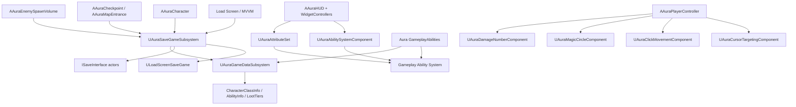

# Aura UE5 Top-Down RPG - 코드/구조 분석 및 포트폴리오 정리

## 1. 프로젝트 요약

`Aura`는 Unreal Engine 5 기반의 탑다운 액션 RPG 베이스 프로젝트입니다. Gameplay Ability System, MVVM 기반 UI, Save/Load 시스템, 체크포인트 기반 월드 진행, 클릭 이동, 적 AI, 루트 드롭, 모듈형 게임플레이 액터 구조를 포함합니다.

현재 코드베이스는 튜토리얼 규모의 구조에서 벗어나, 이후 RPG 기본 베이스로 확장하기 쉽도록 리팩토링되었습니다. 핵심 방향은 거대한 게임플레이 클래스에 집중되어 있던 책임을 별도 시스템으로 분리하는 것이었습니다.

- 저장 슬롯/플레이어 진행/월드 상태 저장 -> `UAuraSaveGameSubsystem`
- 전역 RPG 데이터 에셋 접근 -> `UAuraGameDataSubsystem`
- 플레이어 입력 세부 기능 -> PlayerController 소유 ActorComponent
- 체력/사망 이벤트 -> `UAuraHealthComponent`
- UI 상태 -> MVVM ViewModel 및 WidgetController
- 데이터 정의 -> DataAsset 및 GameplayTag

이 구조를 통해 신규 맵, 저장 슬롯, 적 타입, 어빌리티, 루트 테이블, UI 흐름을 더 안전하게 확장할 수 있습니다.

## 2. 아키텍처 평가

현재 분류: 튜토리얼 기반 프로젝트에서 프로덕션 지향 RPG 베이스로 확장된 구조.

프로젝트는 아직 일부 서버 권한 설정을 `AAuraGameModeBase`에 보관하고 있습니다. 이는 싱글플레이 또는 리슨 서버 기반 RPG 프로토타입에서는 자연스러운 선택입니다. 다만 저장, 데이터 접근, 입력 세부 동작 등 장기적으로 커질 수 있는 책임은 대부분 `UGameInstanceSubsystem` 또는 ActorComponent로 분리되어 있어, GameMode, Character, Widget에 로직이 몰려 있는 구조보다 확장성이 좋습니다.

강점:

- GAS, Enhanced Input, MVVM, SaveGame, GameplayTag, ActorComponent, GameInstanceSubsystem 등 UE 표준 시스템을 적극적으로 사용합니다.
- UI는 저장 구현을 직접 소유하지 않고, 저장 요청만 전달합니다.
- 월드에 배치된 저장 대상 액터는 안정적인 `FGuid` 기반 SaveId로 식별합니다.
- 맵 이동 직전 저장 경합 문제를 동기 저장으로 해결했습니다.
- 공유 데이터 접근은 서버 전용 GameMode가 아닌 GameDataSubsystem을 통해 수행합니다.

향후 확장 포인트:

- 런타임에 동적으로 생성된 액터 복원 시스템은 별도 확장이 필요합니다.
- 저장 슬롯 메타데이터와 무거운 월드 상태 데이터를 분리하면 대형 프로젝트에서 더 유리합니다.
- 일부 에디터/BP 콘텐츠 경고는 코드 구조와 별개로 에셋 설정 검증이 필요합니다.
- 더 큰 프로젝트에서는 월드 복원 타이밍을 `UWorldSubsystem` 또는 레벨 라이프사이클 서비스로 옮길 수 있습니다.

## 3. 상위 시스템 구조도

## 4. 책임 분리 표

| 영역 | 주요 클래스 | 책임 |
|---|---|---|
| 저장/로드 오케스트레이션 | `UAuraSaveGameSubsystem`, `ULoadScreenSaveGame` | 저장 슬롯 생성, 슬롯 선택, 플레이어 진행 저장, 월드 상태 직렬화, 맵 이동 복원 |
| 월드 액터 저장 | `ISaveInterface`, `FSavedActor`, `FSavedMap` | 안정적인 액터 식별, Transform 복원, `SaveGame` 프로퍼티 아카이브 직렬화 |
| 전역 RPG 데이터 | `UAuraGameDataSubsystem` | `CharacterClassInfo`, `AbilityInfo`, `LootTiers`를 config 경로와 캐시를 통해 제공 |
| 게임 규칙/설정 | `AAuraGameModeBase` | PlayerStart 선택, 기본 맵/데이터 참조 |
| 플레이어 런타임 상태 | `AAuraPlayerState`, `UAuraAbilitySystemComponent`, `UAuraAttributeSet` | 레벨, 경험치, 속성, 어빌리티 소유, 복제되는 플레이어 진행 상태 |
| 플레이어 Pawn 동작 | `AAuraCharacter`, `AAuraCharacterBase` | Possession 초기화, ASC 초기화, 사망 처리, PlayerInterface 구현 |
| 적 동작 | `AAuraEnemy`, `AAuraAIController`, SpawnPoint/SpawnVolume | AI 설정, 적 ASC, 클래스 기본값, 루트 드롭, 스폰 볼륨 저장 상태 |
| 입력/컨트롤 | `AAuraPlayerController`, 입력 관련 컴포넌트 | Enhanced Input 바인딩, 카메라 기준 이동, 커서 타겟팅, 오토런, 시각적 타겟팅 |
| UI | `AAuraHUD`, WidgetController, MVVM LoadScreen | HUD 초기화, 속성/스펠/오버레이 바인딩, 로드 화면 상태 관리 |
| 전투/GAS | Aura Ability, Damage Params, Execution Calculation | GameplayEffect 적용, 투사체/빔/화염 어빌리티, 디버프, 데미지 Context 메타데이터 |

## 5. 주요 리팩토링 성과

### 5.1 저장 시스템 현대화

리팩토링 전:

- 저장 책임이 `AAuraGameModeBase`, `AAuraCharacter`, LoadScreen ViewModel, Checkpoint, MapEntrance에 흩어져 있었습니다.
- 액터 저장 매칭이 주로 오브젝트 이름에 의존해 에디터 변경에 취약했습니다.
- 맵 이동 직전 여러 비동기 저장이 같은 슬롯을 대상으로 실행되어 저장 순서 경합이 발생할 수 있었습니다.

리팩토링 후:

- `UAuraSaveGameSubsystem`이 저장 정책을 소유하고, UI/게임플레이에는 좁은 API만 노출합니다.
- `AAuraCharacter::SaveProgress_Implementation`은 저장 세부 구현을 Subsystem에 위임합니다.
- `AAuraCheckpoint`, `AAuraMapEntrance`, `AAuraEnemySpawnVolume`은 Subsystem을 통해 월드 저장을 요청합니다.
- `FSavedActor`는 안정적인 `FGuid SaveId`를 저장하며, 기존 세이브 호환을 위해 이름 기반 fallback도 유지합니다.
- 맵 이동 직전 핵심 저장은 `SaveGameToSlot` 동기 저장으로 처리해 저장 순서를 보장합니다.
- 등록되지 않은 목적지 맵은 빈 맵 이름으로 저장되지 않도록 검증합니다.

포트폴리오 표현:

> 흩어져 있던 SaveGame 로직을 `UGameInstanceSubsystem` 기반 저장 계층으로 리팩토링하고, 안정적인 액터 GUID, 맵 검증, 슬롯 fallback, 결정적인 저장 순서를 추가하여 멀티 맵 RPG 진행을 안정화했습니다.

### 5.2 GameMode 책임 축소

리팩토링 전:

- `GameMode`가 저장 슬롯 처리, 맵 이동, 월드 직렬화, 플레이어 사망 후 복원을 모두 담당했습니다.
- 공유 코드가 서버에만 존재하는 GameMode에 의존할 위험이 있었습니다.

리팩토링 후:

- `AAuraGameModeBase`는 게임 규칙 설정과 `ChoosePlayerStart` 중심으로 단순화되었습니다.
- 저장/데이터 흐름은 `UAuraSaveGameSubsystem`, `UAuraGameDataSubsystem`을 통해 처리합니다.
- `UAuraAbilitySystemLibrary`는 핵심 데이터 에셋 접근 시 GameMode에 직접 의존하지 않습니다.

포트폴리오 표현:

> GameMode에 집중되어 있던 저장 및 데이터 접근 책임을 GameInstance 레벨 Subsystem으로 분리하여 UI, GAS, 게임플레이 액터에서 재사용 가능한 구조로 개선했습니다.

### 5.3 PlayerController 분해

리팩토링 전:

- PlayerController가 커서 Trace, 오토런, 매직서클, 입력 라우팅, 데미지 텍스트 출력, 타겟팅 상태를 모두 직접 담당했습니다.

리팩토링 후:

- `UAuraCursorTargetingComponent`가 커서 Trace와 Highlight 전환을 담당합니다.
- `UAuraClickMovementComponent`가 클릭 이동, 목적지 캐시, Spline 오토런, 클릭 VFX를 담당합니다.
- `UAuraMagicCircleComponent`가 타겟팅 Decal 생명주기를 담당합니다.
- `UAuraDamageNumberComponent`가 데미지 텍스트 생성을 담당합니다.
- `AAuraPlayerController`는 입력을 조율하는 오케스트레이터 역할에 집중합니다.

포트폴리오 표현:

> 비대해진 PlayerController를 커서 타겟팅, 클릭 이동, 타겟팅 Decal, 데미지 텍스트 컴포넌트로 분리하여 기능별 독립성과 유지보수성을 개선했습니다.

### 5.4 GAS 및 RPG 데이터 흐름

이 프로젝트는 GAS를 전투/성장 시스템의 중심으로 사용합니다.

- `AAuraPlayerState`는 플레이어 ASC와 AttributeSet을 소유합니다.
- `AAuraEnemy`는 적 전용 ASC를 소유하며 Minimal Replication 모드를 사용합니다.
- `UAuraAttributeSet`은 Primary, Secondary, Vital, Resistance 계열 속성을 정의합니다.
- `UAuraAbilitySystemComponent`는 어빌리티 상태, 입력 태그, 장착 슬롯, 저장/로드 어빌리티 Spec을 관리합니다.
- `UAuraAbilitySystemLibrary`는 기본 속성 초기화, 어빌리티 데이터 조회, Radial Damage 메타데이터, 타겟 선택 등 재사용 가능한 GAS 헬퍼를 제공합니다.
- `UAuraGameDataSubsystem`은 `UCharacterClassInfo`, `UAbilityInfo`, `ULootTiers` 접근을 중앙화합니다.

포트폴리오 표현:

> DataAsset 기반 클래스 기본값, 어빌리티 메타데이터, 디버프/데미지 Context 직렬화, 지속 가능한 어빌리티 진행 저장을 포함한 GAS 기반 RPG 프레임워크를 구축했습니다.

### 5.5 체크포인트 및 멀티 맵 진행

구현/정리된 동작:

- 체크포인트 도달 상태가 저장됩니다.
- 맵 입구는 현재 월드 상태 저장, 목적지 맵 정보 갱신, 플레이어 진행 저장, 맵 이동을 순서대로 처리합니다.
- PlayerStart Tag를 통해 재시작 위치를 복원합니다.
- WASD 이동 방향은 체크포인트 회전이 아니라 카메라 Yaw 기준으로 계산됩니다.
- 체크포인트의 MoveToComponent가 클릭 오토런 목적지를 정상적으로 오버라이드합니다.

포트폴리오 표현:

> 체크포인트 기반 멀티 맵 진행 시스템을 구현하고, 도달 상태 저장, PlayerStart 복원, 클릭 이동 목적지 오버라이드 흐름을 안정화했습니다.

## 6. 포트폴리오용 프로젝트 설명 양식

### 짧은 소개문

Aura는 Unreal Engine 5 기반 탑다운 액션 RPG 프레임워크입니다. Gameplay Ability System, Enhanced Input, MVVM UI, 멀티 슬롯 SaveGame, 체크포인트 기반 맵 진행, AI 적, 루트 드롭, 모듈형 PlayerController 구조를 포함합니다. 저는 튜토리얼 규모의 코드를 RPG 기본 베이스로 확장 가능하도록 저장, 데이터, 입력 책임을 Subsystem과 Component로 분리하는 리팩토링을 중심으로 작업했습니다.

### 이력서 Bullet 문장

- UE5 Gameplay Ability System, Enhanced Input, MVVM, DataAsset, GameplayTag, AI, Loot, Checkpoint 기반 진행을 포함한 탑다운 RPG 프레임워크를 구현 및 리팩토링했습니다.
- `UGameInstanceSubsystem` 기반 SaveGame 구조를 설계하여 멀티 슬롯, 플레이어 진행, 월드 액터 직렬화, 맵 이동 복원, GUID 기반 액터 식별을 지원했습니다.
- PlayerController의 커서 타겟팅, 오토런 이동, 매직서클 타겟팅, 데미지 숫자 표시 기능을 ActorComponent로 분리했습니다.
- 전역 RPG 데이터 에셋 접근을 GameDataSubsystem으로 중앙화하여 서버 전용 GameMode 의존도를 줄였습니다.
- 비동기 저장과 맵 이동 사이의 저장 경합 문제를 분석하고, 결정적 저장 순서와 맵 검증 로직을 추가해 저장 안정성을 개선했습니다.

### 면접 답변용 설명

> 이 프로젝트는 GAS, Attribute, Ability, 적 AI, UI를 갖춘 탑다운 RPG 코드베이스에서 시작했습니다. 제 주요 목표는 이 코드를 단순 튜토리얼 결과물이 아니라 재사용 가능한 RPG 베이스로 만드는 것이었습니다. 그래서 저장과 월드 상태 관리를 GameMode와 Character에서 분리해 `UGameInstanceSubsystem`으로 옮겼고, 저장 대상 액터에는 GUID 기반 식별자를 추가했습니다. 또한 RPG 데이터 에셋 접근을 GameDataSubsystem으로 중앙화하고, PlayerController의 입력 관련 세부 동작을 여러 ActorComponent로 분리했습니다. 결과적으로 UI는 저장 요청만 전달하고, 게임플레이 액터는 Subsystem을 통해 Persistence를 요청하며, GAS와 데이터 시스템은 서버 전용 클래스에 덜 의존하는 구조가 되었습니다.

### STAR 사례: Save/Load 버그 해결

Situation:

- 두 번째 던전으로 이동한 뒤 저장하고 재시작하면 저장 슬롯이 초기화된 것처럼 보이는 문제가 있었습니다.

Task:

- 실제로 파일이 삭제되는지, 저장 데이터가 깨지는지, 저장 순서 문제인지 원인을 파악해야 했습니다.

Action:

- 런타임 로그와 SaveGames 폴더 상태를 확인했습니다.
- 슬롯 생성, 월드 저장, 플레이어 진행 저장, 맵 이동 호출 순서를 추적했습니다.
- 맵 이동 직전에 여러 `AsyncSaveGameToSlot` 호출이 같은 슬롯에 겹치며 저장 순서가 꼬일 수 있음을 확인했습니다.
- 핵심 저장 경로를 `SaveGameToSlot` 기반 동기 저장으로 변경하고, 목적지 맵 등록 검증을 추가했습니다.

Result:

- 던전 이동 및 재시작 후에도 슬롯 진행 데이터가 안정적으로 유지되었습니다.
- SaveSubsystem의 실패 로그와 맵 검증 로직이 명확해졌습니다.

### STAR 사례: PlayerController 리팩토링

Situation:

- PlayerController가 커서 Trace, 클릭 이동, 타겟팅 Decal, 데미지 텍스트 표시, 어빌리티 입력 처리까지 너무 많은 책임을 갖고 있었습니다.

Task:

- 기능을 확장할 때 관련 없는 로직을 건드리지 않도록 구조를 개선해야 했습니다.

Action:

- 커서 타겟팅, 클릭 이동, 매직서클, 데미지 숫자 표시 기능을 각각 ActorComponent로 분리했습니다.
- PlayerController는 입력 이벤트를 받고 각 컴포넌트에 위임하는 역할로 축소했습니다.

Result:

- 신규 입력/타겟팅 기능을 추가할 때 수정 범위가 줄어들었습니다.
- PlayerController가 거대한 기능 컨테이너가 아니라 입력 오케스트레이터로 정리되었습니다.

## 7. 포트폴리오에서 보여주기 좋은 기술 포인트

추천 영상/스크린샷:

- 로드 화면에서 저장 슬롯 생성/선택/삭제
- 체크포인트 활성화 후 재시작 위치 복원
- Dungeon에서 Dungeon_2로 이동 후 진행 상태 유지
- 어빌리티 전투, 데미지 숫자, 디버프 적용
- 커서 Highlight, 클릭 오토런, 매직서클 타겟팅
- 적 사망 및 루트 드롭
- 속성/스펠 UI와 MVVM/WidgetController 연동

추천 코드 스니펫:

- `UAuraSaveGameSubsystem::SaveWorldState`
- `UAuraSaveGameSubsystem::LoadWorldState`
- `AAuraCharacter::SaveProgress_Implementation`
- `UAuraClickMovementComponent::TryStartAutoRun`
- `UAuraCursorTargetingComponent::OverrideMoveToLocationOnTarget`
- `UAuraAbilitySystemLibrary::InitializeDefaultAttributesFromSaveData`

## 8. 파일별 책임 맵

| 기능 | 파일 |
|---|---|
| SaveSubsystem | `Source/Aura/Public/Game/AuraSaveGameSubsystem.h`, `Source/Aura/Private/Game/AuraSaveGameSubsystem.cpp` |
| Save 데이터 DTO | `Source/Aura/Public/Game/LoadScreenSaveGame.h`, `Source/Aura/Private/Game/LoadScreenSaveGame.cpp` |
| 저장 기본값 | `Source/Aura/Public/Game/AuraSaveDefaults.h` |
| GameDataSubsystem | `Source/Aura/Public/Game/AuraGameDataSubsystem.h`, `Source/Aura/Private/Game/AuraGameDataSubsystem.cpp` |
| GameMode | `Source/Aura/Public/Game/AuraGameModeBase.h`, `Source/Aura/Private/Game/AuraGameModeBase.cpp` |
| PlayerController | `Source/Aura/Public/Player/AuraPlayerController.h`, `Source/Aura/Private/Player/AuraPlayerController.cpp` |
| PlayerController 컴포넌트 | `AuraClickMovementComponent`, `AuraCursorTargetingComponent`, `AuraMagicCircleComponent`, `AuraDamageNumberComponent` |
| 캐릭터/플레이어 저장 | `Source/Aura/Public/Character/AuraCharacter.h`, `Source/Aura/Private/Character/AuraCharacter.cpp` |
| 적/루트 | `Source/Aura/Public/Character/AuraEnemy.h`, `Source/Aura/Private/Character/AuraEnemy.cpp` |
| 체크포인트/맵 입구 | `Source/Aura/Public/Checkpoint/AuraCheckpoint.h`, `AuraMapEntrance.h` |
| GAS 라이브러리 | `Source/Aura/Public/AbilitySystem/AuraAbilitySystemLibrary.h`, `Source/Aura/Private/AbilitySystem/AuraAbilitySystemLibrary.cpp` |
| ASC/Attribute | `Source/Aura/Public/AbilitySystem/AuraAbilitySystemComponent.h`, `AuraAttributeSet.h` |
| UI/MVVM | `Source/Aura/Public/UI/ViewModel/MVVMLoadScreen.h`, `MVVMLoadSlot.h`, `Source/Aura/Public/UI/HUD/AuraHUD.h` |

## 9. 아키텍처 비교 표

| 영역 | 현재 구조 | UE 일반/현대적 구조 | 평가 |
|---|---|---|---|
| 저장 오케스트레이션 | `UAuraSaveGameSubsystem` | `UGameInstanceSubsystem` 또는 Save Manager UObject | 크로스 맵 저장 슬롯에 적합 |
| 월드 액터 저장 | `ISaveInterface` + Archive + 안정적 `FGuid` | 명시적 안정 ID, SaveGame Archive | 배치 액터 저장 기반으로 우수 |
| 동적 액터 저장 | 루트/스폰 동작은 있으나 일반화된 동적 액터 복원은 제한적 | Spawn Registry/Factory + Save Record | 향후 확장 포인트 |
| 데이터 접근 | `UAuraGameDataSubsystem` + config path/cache | Subsystem 또는 AssetManager/PrimaryDataAsset | 중간 규모 프로젝트에 적절 |
| GameMode | 기본값과 PlayerStart 선택 중심 | 서버 게임 규칙 중심 | 이전보다 훨씬 단순해짐 |
| UI | MVVM LoadScreen + WidgetController | MVVM/ViewModel 기반 UI 상태 | 좋은 방향 |
| 플레이어 입력 | Controller 조율 + Component 분리 | 독립 동작은 Component화 | 좋은 방향 |
| GAS | PlayerState ASC, Enemy ASC, AbilitySystemLibrary Helper | GAS 표준 소유 패턴 | RPG 베이스로 적합 |
| 저장 슬롯 메타데이터 | 플레이어/월드 상태와 같은 SaveGame에 저장 | 메타데이터와 무거운 월드 데이터 분리 | 현재 규모에서는 허용 가능 |

## 10. 분석 범위와 한계

이 분석은 C++ 소스, 설정 파일, 현재 리팩토링 상태를 기준으로 작성되었습니다. 아래 항목은 완전 검증 범위에 포함하지 않았습니다.

- Blueprint 그래프 내부 로직
- `.uasset` 내부 에셋 참조
- 패키징 빌드 동작
- Dedicated Server 동작
- 여러 프로젝트 버전을 거치는 장기 Save Migration

현재 프로젝트는 리팩토링 이후 `AuraEditor Win64 Development` 빌드를 통과했고, 최근 에디터 인게임 테스트에서 주요 흐름이 정상 작동하는 것으로 확인되었습니다.

## 11. 포트폴리오 페이지 구성 추천

아래 순서로 구성하면 좋습니다.

1. 프로젝트 제목과 한 줄 소개
2. 30초 내외 플레이 영상 또는 GIF
3. 담당 역할과 기여 요약
4. 아키텍처 다이어그램
5. 해결한 주요 엔지니어링 문제 3가지
6. 리팩토링 전/후 구조
7. 기술 스택
8. Save/Load, 전투, UI, 맵 이동 스크린샷
9. 배운 점과 향후 개선 계획

예시 제목:

> Aura - UE5 GAS 기반 Top-Down RPG Framework

예시 부제:

> Gameplay Ability System, MVVM UI, 멀티 슬롯 SaveGame, 체크포인트 기반 맵 진행, 모듈형 플레이어 컨트롤 아키텍처를 갖춘 RPG 베이스 프로젝트.

## 12. 향후 개선 로드맵

이 프로젝트를 더 큰 RPG로 확장한다면 다음 개선이 유효합니다.

- 저장 슬롯 메타데이터와 무거운 월드 액터 데이터를 분리
- 명시적인 Save Version Migration 테스트 추가
- 배치 액터 외 동적 생성 액터 복원 시스템 추가
- 슬롯 생성/로드/삭제 및 맵 이동 저장에 대한 자동 Smoke Test 추가
- 디자이너 제어가 더 필요하다면 맵 Registry와 기본 맵 설정을 GameMode가 아닌 별도 DataAsset으로 이동
- SaveId 중복, 맵 등록, 필수 DataAsset 참조를 검증하는 DataValidation 규칙 추가
